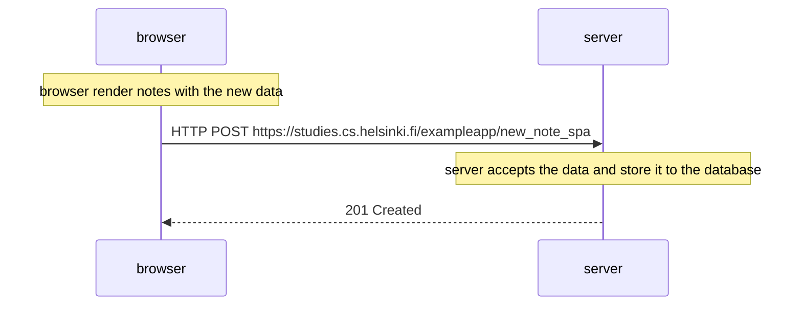

# 0.6: New note in Single page app diagram

```mermaid
sequenceDiagram
Note over browser: browser render notes with the new data
browser->>server: HTTP POST https://studies.cs.helsinki.fi/exampleapp/new_note_spa
Note over server: server accepts the data and store it to the database
server-->>browser: 201 Created
```
